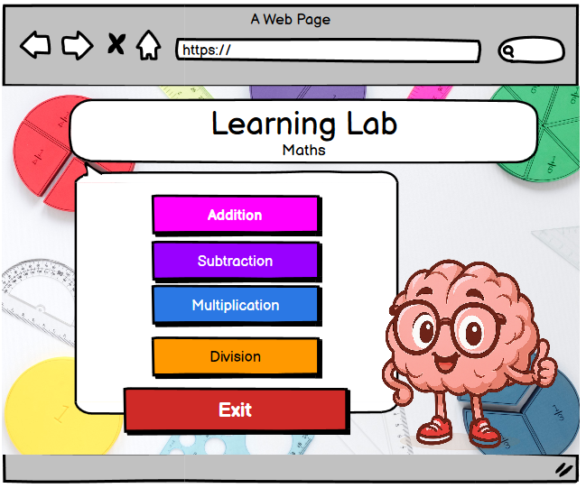
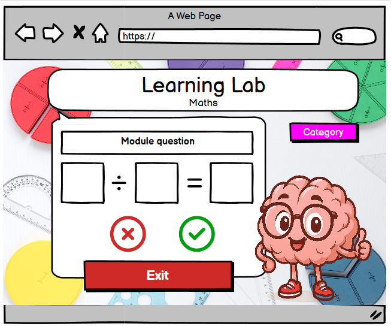
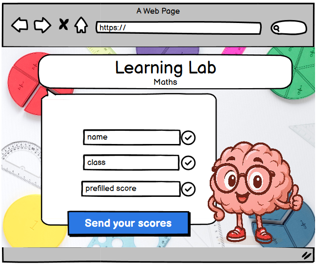
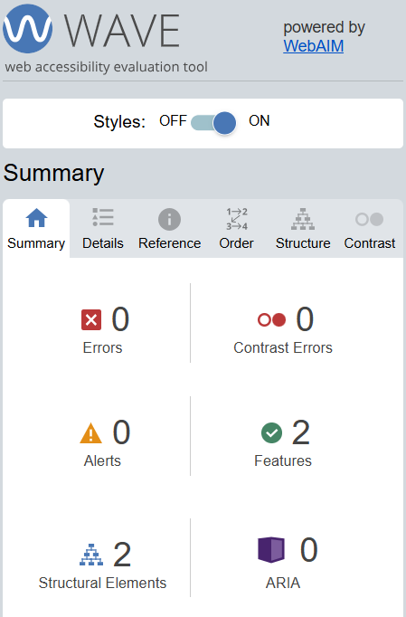

# Learning Lab: Math Quest

## Table of Contents
- [Overview](#overview)
  - [Planning Stage](#planning-stage)
  - [Target Audiences](#target-audiences)
  - [User Stories](#user-stories)
  - [Site Aims](#site-aims)
  - [Design](#design)
    - [Wireframes](#wireframes)
    - [Color Scheme & Typography](#color-scheme--typography)
- [Features](#features)
- [Future Features](#future-features)
- [Technologies Used](#technologies-used)
- [Testing](#testing)
- [Deployment](#deployment)
- [Credits](#credits)
- [Acknowledgements](#acknowledgements)

## Overview
Learning Lab is a learning platform for multiple subjects such as Maths, English, Science, Geography etc.
This website is focused on the Maths subject, which is specifically designed for young learners in primary school years.
This interactive browser-based maths game is designed to help young learners practice random math questions, once subcategories are selected. Learners will progress through levels and earn points. The game is designed with a focus on education and engagement, this webpage can be used within schools aswell as home learning.
## Planning Stage
The planning stage involved defining the target audience, user experience, and design elements of the Learning Lab platform. The goal was to create an engaging and educational experience for young learners, while also being accessible to parents, teachers, and users with accessibility needs.
#### Target Audiences:
- Young learners in primary school years (ages 5-11).
- Parents and teachers looking for educational resources.
- Users with accessibility needs, including neurodiverse learners.
- Players who enjoy interactive and gamified learning experiences.
## User Experience
### User Stories
- As a young learner, I want to practice maths in a fun and challenging way.
- As a parent/teacher, I want a educational platform that focuses on maths skills.
- As a player, I want my progress to be seen by my teacher/parent.
- As a user with accessibility needs, I want the platform to be accessible and easy to navigate.
- As a neurodiverse learner, I want a learning platform that is engaging and not overwhelming or understimulating.
- As a young learner, I want to stay engaged and feel good about my learning experience.
- As a user, I want the platform to be responsive and work well on different devices.
#### Site Aims:
- To provide a fun and engaging way for young learners to practice maths skills.
- To create a platform that is accessible and easy to navigate for all users, including those with neurodiversity.
- To ensure the platform is responsive and works well on various devices, including desktops, tablets, and mobile phones.
- To provide a learning platform that supports teachers and parents in gaining insight into the progress of their young learner.
### Design
#### Wireframes

Wireframes for each section were created using Balsamiq. This process provided a basic but clear outline of how each section would look as well as arranging what layout worked best.

# Initial wireframes

# Revised wireframes

The wireframes were to define the layout and structure of the Learning lab platform. after consideration of various learning style and abilities it was best to scale back and simplify the design to ensure a more focused and effective learning experience. The final design includes a clean layout with clear navigation, interactive elements, and visual feedback to enhance user engagement.

#### Colour Scheme & Typography

## Colour Scheme
With Neurodiversity in mind, the colour scheme is designed to be calming and engaging, avoiding overly bright or harsh colours. The colours are chosen to provide a balance between stimulation and calmness, making it suitable for young learners.
Page Background	#f0f8ff	Soft Alice Blue – calming, light
Buttons	#4f46e5	Deep Indigo – strong primary color
Button Hover	#6366f1	Lighter Indigo – visual interaction
Correct Answer Text	#22c55e	Vibrant Green – success
Incorrect Feedback	#facc15	Warm Yellow – gentle retry cue
Score Highlight	#10b981	Green – matches correct pulse
End Message	#4f46e5	Same Indigo – unified heading color

## Features
- Random addition and substraction questions.
- Feedback on answers.
- Score tracking for correct answers.
- Responsive design for desktop, tablet and mobile devices.

## Future Features
- Challenge other classmates or friends in real-time.
- Account set up for tracking progress for parents and teachers.
- Countdown timer for each question to add a competitive element.
- Additional subjects such as English, Science, and Geography.
- User being able to select a difficulty level for each question.

## Technologies Used
I used the following technologies for this project:
- HTML5
- CSS
- JavaScript
- Git
- GitHub
- Visual Studio Code
- GPT-4o
- VS Code Copilot
- Chrome DevTools
- W3C Validator FOR HTML and CSS
- Lighthouse for performance testing
- Wave for accessibility testing

## Testing
# User Testing
### 🧪 User Stories Testing

| **User Story** | **Action/Test Performed** | **Actual Outcome** |
|----------------|---------------------------|---------------------|
| As a young learner, I want to practice maths in a fun and challenging way. | The website is designed with interactive elements, animations, visual feedback, and colorful gamified features. | Color scheme is calm and playful. Game features (score, feedback, mascot) add engagement and fun. |
| As a parent/teacher, I want an educational platform that focuses on maths skills. | All questions are math-based and organised by category (addition, subtraction, etc.). Pages tested to ensure correct topics load. | Each category page presents clear, age-appropriate math questions. No non-educational distractions present. |
| As a player, I want my progress to be seen by my teacher/parent. | A score summary is shown at the end of each round and saved to localStorage. Results page includes user’s name and correct answers. | Score is visible on the results page and can be submitted to FormDump. Results clearly show correct answers. |
| As a user with accessibility needs, I want the platform to be accessible and easy to navigate. | Tested keyboard navigation, alt text for images, and high contrast visibility. Checked tab order and focus visibility. | All key elements are accessible using keyboard. Layout is clear and readable. Focus states are visible. |
| As a neurodiverse learner, I want a learning platform that is engaging and not overwhelming or understimulating. | Limited each round to 5 questions, added visual animations and mascot. Used positive messaging and clean layout. | Questions are short, positive feedback is encouraging, and the layout avoids cognitive overload. |
| As a young learner, I want to stay engaged and feel good about my learning experience. | Feedback messages include praise for correct answers and encouraging retries for wrong ones. Progress is visible. | Users receive emoji-based praise or retry prompts, helping them stay motivated and confident. |
| As a user, I want the platform to be responsive and work well on different devices. | Tested across Chrome, Firefox, and mobile (iOS/Android) using responsive design tools and physical devices. | Buttons stack correctly, layout adapts to screen size, and all interactive features work on mobile. |

# Validation
HTML

CSS

Lighthouse

WAVE

## Bug tracking and reporting.

The following bugs were also identified during user testing:

| **Bug** | **Action / Test Taken** | **Actual Outcome** |
|--------|--------------------------|--------------------|
| JavaScript not loading | Checked browser console – saw `404` error for `script.js`. Verified script path and corrected `<script src="...">`. | JavaScript loaded successfully; all game features (score, questions) worked. |
| No question displayed after "Get ready..." | Logged `mode` value with `console.log()` in `generateQuestion()`. Found `getPageType()` was returning `null`. | Renamed HTML files to include expected keywords (e.g., `addition`), fixing mode detection. |
| Form submission reloaded the page | Used `e.preventDefault()` and replaced form action with a `fetch()` POST to FormDump. | Page stayed loaded; results submitted in background. |
| "Continue" button didn't appear after submit | Realized form was refreshing page. Rebuilt logic with `fetch()` and DOM update to reveal `#next-section-wrap`. | Button appeared as expected after form submission. |
| Continue button only appeared using browser back | Confirmed default form reload caused page reset. Intercepted form with JS and retained state. | Button now appears immediately without navigating back. |
| Extra closing `</button>` tag in HTML | Inspected HTML manually and removed extra closing tag. | Page rendered properly with no visual/syntax issues. |
| Buttons not stacking on small screens | Added `.button-group` container and styled with `flex-direction: column`. | Buttons are stacked vertically on all screen sizes. |
| Questions not displaying on results page | `questionHistory` was inside function and resetting. Moved to global scope, used `localStorage` to store/retrieve. | Results now show full list of answered questions. |
| Progress bar not updating | Used inline style widths (`25%`, `50%`, etc.) per page manually. | Visual progress bar now accurately reflects section. |
| No visual feedback after score submitted | Used JS to change button text: `✅ Submitted! Continue`. | User sees confirmation immediately after submit. |

## Deployment
This site was deployed using Github Pages:

## Credits
# General reference:
- W3Schools for HTML, CSS, and JavaScript tutorials.
- Open AI for providing assistance with code and debugging.
- VS Code Copilot for code suggestions and improvements.

#Media:
- All images used in this project were sourced and altered from Freepik and its AI assistant, a website that provides free images and illustrations.

https://www.freepik.com/

- Learning Lab Mascot: Created using Freepik's AI assistant.
original image: https://www.freepik.com/free-vector/8100-5-205_40675149.htm#fromView=search&page=1&position=20&uuid=ed50f3a8-123f-48cb-bb4a-b6ff73d6cc0d&query=brain+mascot

